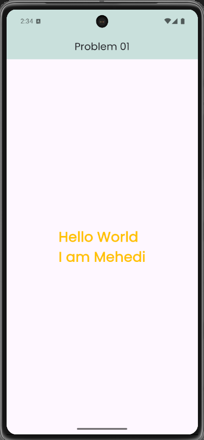
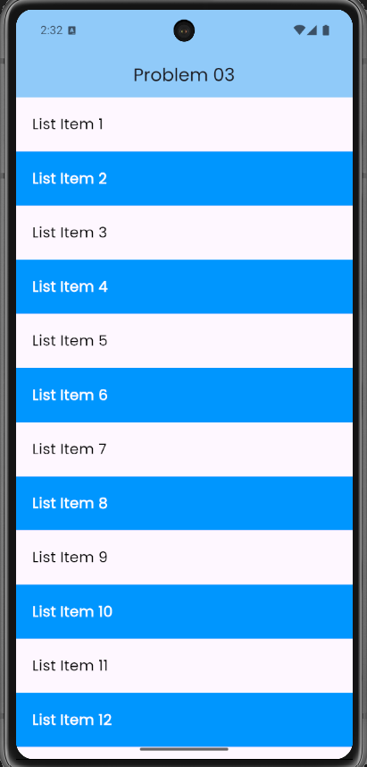
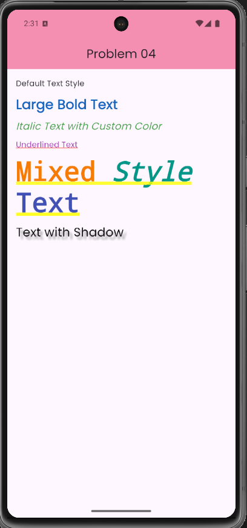
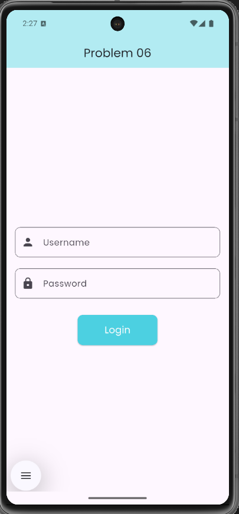
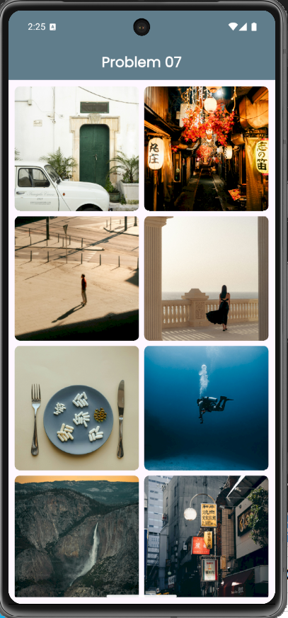
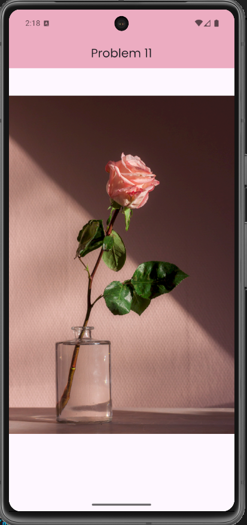
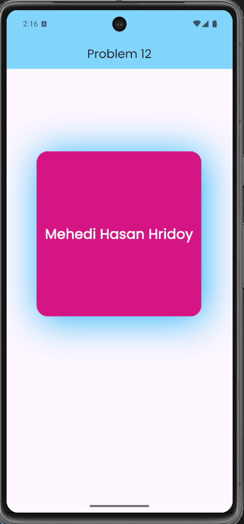
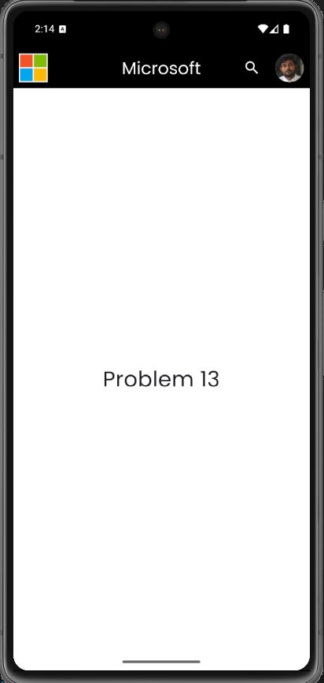

# Flutter Practice Tracker

## About the Repository
This repository is created as part of my Flutter development practice. It serves as a collection of projects and solutions to problems provided in the practice sheet given by our faculty. Through this repository, I aim to enhance my skills in Flutter, explore different UI/UX components, and strengthen my understanding of mobile application development.

## Author
**Name:** Mehedi Hasan Hridoy  
**Section:** 61_B1  
**ID:** 221-15-5097  
**University:** Daffodil International University  

## Problem Statements & Solutions
This section contains the problem statements along with their solutions in the form of screenshots or GIF images.

### Problem 1:
**Problem Statement:**
> *[Create a basic Flutter application that displays "Hello World!" in the center of the screen with a custom font and color.]*

**Solution Screenshot:**
  

### Problem 2:
**Problem Statement:**
> *[Create a Flutter app with a button that, when pressed, changes the text on the screen to "Button Pressed". Use a StatefulWidget for this.]*

**Solution Screenshot:**
  

### Problem 3:
**Problem Statement:**
> *[Create an app that displays a list of items using a ListView. Each item should be a text widget with a unique number.]*

**Solution Screenshot:**
  

### Problem 4:
**Problem Statement:**
> *[Design an app where you use various text styles, such as changing font sizes, weights, and color. Show how to style Text widgets within a Column or Row.]*

**Solution Screenshot:**
  

### Problem 5:
**Problem Statement:**
> *[Create an app with two screens. The first screen should have a button that navigates to the second screen. The second screen should have a back button that returns to the first screen.]*

**Solution Screenshot:**
  

### Problem 6:
**Problem Statement:**
> *[Build a login screen with two text fields: one for the username and one for the password. Add validation for the form to ensure the fields are not empty. Show an error message if the user presses the submit button while the fields are empty.]*

**Solution Screenshot:**
  

### Problem 7:
**Problem Statement:**
> *[Create an app that displays images in a grid layout using GridView. The images can be placeholders or from URLs. Include some padding between items and ensure the layout is responsive.]*

**Solution Screenshot:**
  

### Problem 8:
**Problem Statement:**
> *[Design an app with a navigation drawer. The drawer should have multiple options, and each option should navigate to a different screen using a Navigator.]*

**Solution Screenshot:**
  

### Problem 9:
**Problem Statement:**
> *[Build a custom Card widget that has an image, a title, a subtitle, and a description. Ensure it has smooth animations (like hover effect) when tapped. Use this custom widget in a ListView to display a list of items.]*

**Solution Screenshot:**
  

### Problem 10:
**Problem Statement:**
> *[Design an app with a bottom navigation bar that contains three tabs (Home, Search, Profile). Each tab should show different content (like images, text, etc.). Ensure the transition between tabs is smooth.]*

**Solution Screenshot:**
  

### Problem 11:
**Problem Statement:**
> *[Build an app that displays an image from the local assets. Set up your pubspec.yaml file properly to include the asset.]*

**Solution Screenshot:**
  

### Problem 12:
**Problem Statement:**
> *[Design a container with a colored background, rounded corners, and a shadow. Inside the container, display a Text widget.]*

**Solution Screenshot:**
  

### Problem 13:
**Problem Statement:**
> *[Create an app with a customized AppBar. Add a logo, title, and actions like a search button or menu icon.]*

**Solution Screenshot:**
  

### Problem 14:
**Problem Statement:**
> *[Build a list where each item can be swiped to reveal additional options like "Delete" or "Edit".]*

**Solution Screenshot:**
  

### Problem 15:
**Problem Statement:**
> *[Create an app where the user can pick a date and a time. Display the selected date and time on the screen.]*

**Solution Screenshot:**
  

### Problem 16:
**Problem Statement:**
> *[Design a simple app where a container changes its size, color, and shape when a button is clicked, using animation.]*

**Solution Screenshot:**
  

### Problem 17:
**Problem Statement:**
> *[Create a simple settings screen with a toggle switch that enables or disables a feature (like dark mode).]*

**Solution Screenshot:**
  

### Problem 18:
**Problem Statement:**
> *[Create a profile page with a circular avatar. Allow the user to choose an image from their gallery (use ImagePicker package).]*

**Solution Screenshot:**
  

### Problem 19:
**Problem Statement:**
> *[Create a side drawer that slides in from the left when a button is pressed, with custom animation.]*

**Solution Screenshot:**
  

## Purpose
- Practice Flutter development systematically.
- Solve the faculty-provided practice sheet to reinforce learning.
- Implement different concepts and best practices in mobile app development.
- Track progress and improvements over time.

## Technologies Used
- **Flutter** (Dart)
- **Android Studio** / **VS Code** (Development Environment)

## How to Use
1. Clone the repository:
   ```sh
   git clone https://github.com/yourusername/flutter-practice-tracker.git
   ```
2. Navigate to the project directory:
   ```sh
   cd flutter-practice-tracker
   ```
3. Install dependencies:
   ```sh
   flutter pub get
   ```
4. Run the app:
   ```sh
   flutter run
   ```

## Contributions
This repository is primarily for my personal practice, but suggestions and improvements are always welcome. Feel free to open issues or submit pull requests.

## License
This project is for educational purposes and is not intended for commercial use.

---

Stay tuned for more Flutter projects and improvements! 🚀

